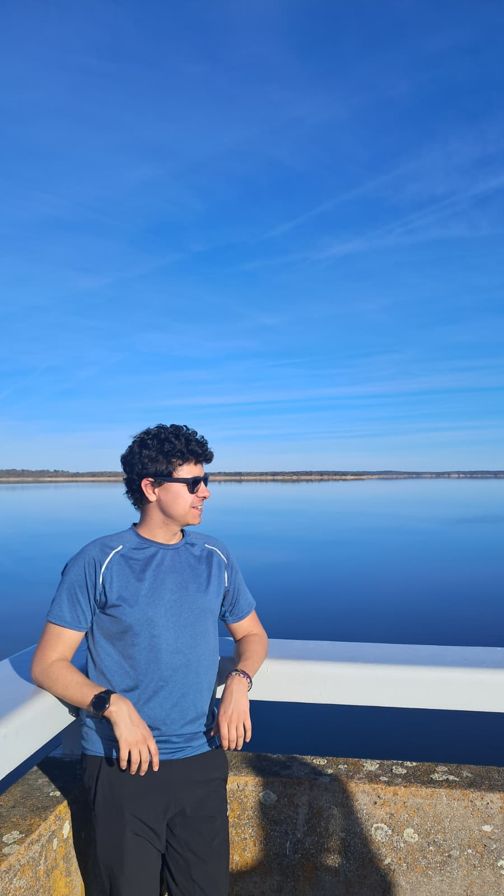

Bienvenid@s — somos el equipo detrás de Napkin Notes. Creemos en las ideas pequeñas que generan impacto: por eso usamos **napkin notes** como método para capturar, refinar y compartir nuestras ideas rápidas.

  

    
    

      
Duvier Suarez Fontanella

      
Físico teórico y curioso incorregible, dedicado a rastrear las leyes secretas que gobiernan tanto al cosmos como a los detalles más triviales de la vida diaria. Sus textos buscan lo mismo que la antigua Fundación: preservar el conocimiento, iluminar lo oculto y demostrar que incluso en una servilleta puede comenzar una nueva era científica

    

  

  

    
    

      
Gretel Quintero Angulo

      
Gretel es científica de formación, escritora por placer y feminista por necesidad. Observa el mundo con la precisión de quien ha sido educada en el método científico y la sensibilidad de quien encuentra en la escritura una forma de interpretar lo cotidiano. Su trabajo combina pensamiento crítico y voz propia, explorando las estructuras —visibles e invisibles— que moldean nuestras vidas.

    

  

  

    
    

      
David Figuer

      
Investigador en cosmología que busca comprender el universo y el rol de la materia y energía oscuras en él. Interesado las ecuaciones y las preguntas fundamentales: qué significa entender en física y qué es "verdad" al observar solo una fracción mínima del cosmos. Trabaja interpretando las pistas que el universo nos deja en forma de datos, intentando averiguar qué historias encajan con ellas y cuáles no.  
Financiación: Personal investigador doctor de la UPV/EHU (2024). 

    

  

  

    
    

      
Gabriel

      
Co-fundador · Diseño

    

  

## ¿Qué son las *napkin notes*?

Las *napkin notes* (notas en servilleta) son ese boceto rápido, frase o diagrama hecho en cualquier superficie —lo importante es que captura una idea en el momento. Para nosotros:

- Son la forma más rápida de validar hipótesis de manera divertida .
- Nos ayudan a documentar conversaciones .
- Funcionan como archivo colectivo: cada nota puede convertirse después en una entrada, un ticket o una propuesta.
- Como la Fundacion queremos guardar al mnos un pequena parte del conocimiento de nuestra especie. Si tambien somos muy nerd.

---
